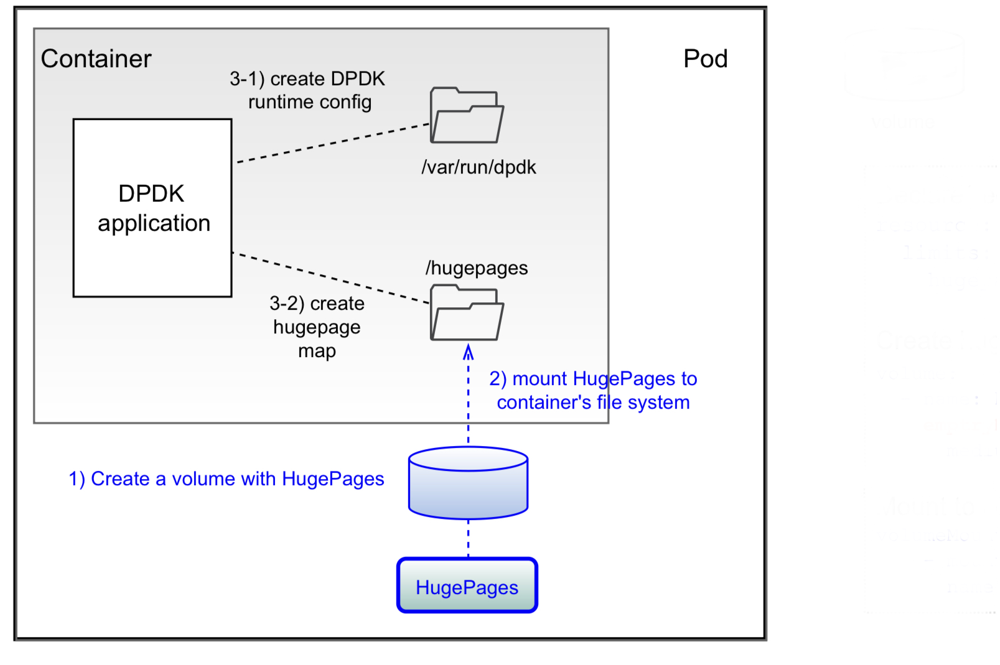
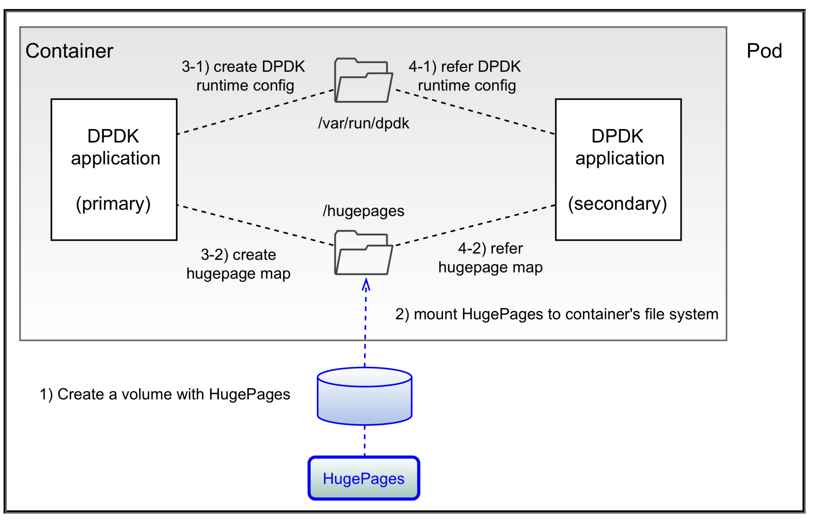
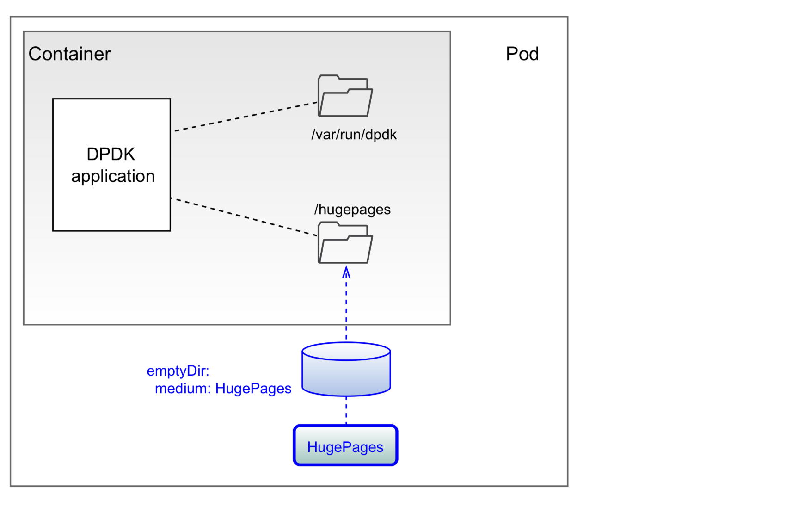
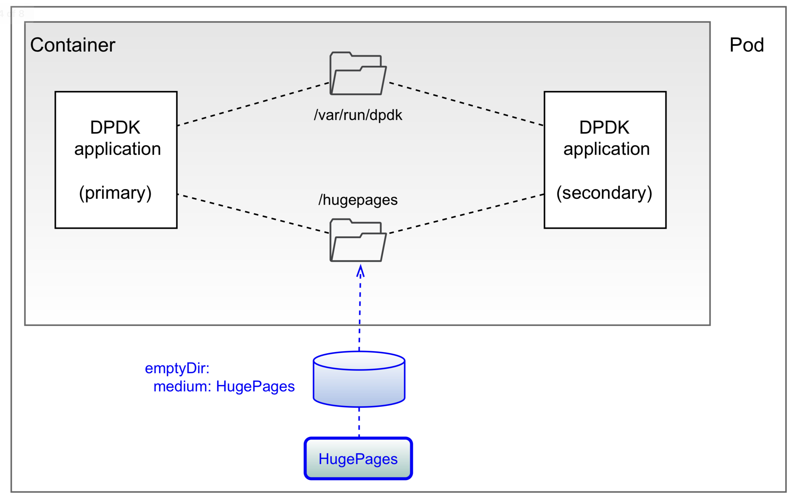

# A single container in a pod

## Define hugepage volume with `emptyDir`

```yaml
  volumes:
  - name: hugepage
    emptyDir:
      medium: HugePages
```

## DPDK runtime config

Nothing to do as `/var/run` is already exist in container filesystem

## Mount hugepage on a container

```yaml
  containers:
  ...
    volumeMounts:
    - mountPath: /hugepages
      name: hugepage
```
  
  
  
  
