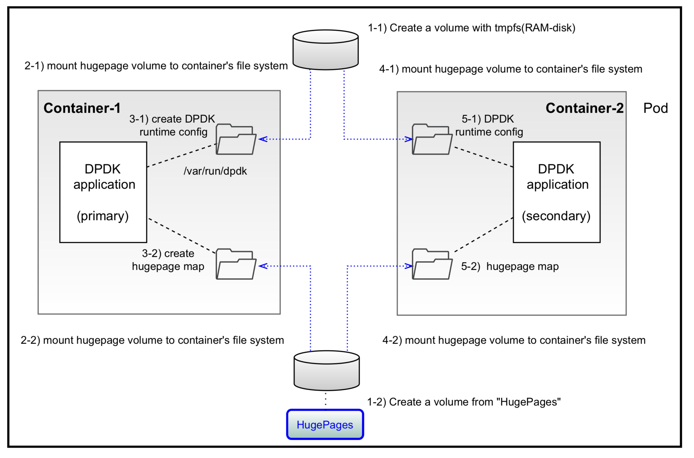
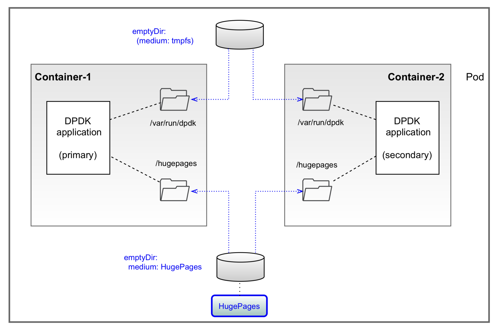

# Two containers in a pod

## Define hugepage volume with `emptyDir`

```yaml
  volumes:
  - name: hugepage
    emptyDir:
      medium: HugePages
```

## Also define a volume with `emptyDir` to store DPDK runtime config files

```yaml
  - name: dpdk-config
    emptyDir:
```

## Mount hugepage on each container

```yaml
  containers:
  ...
    volumeMounts:
    - mountPath: /hugepages
      name: hugepage
    - mountPath: /var/run/dpdk
      name: dpdk-config
```
  

